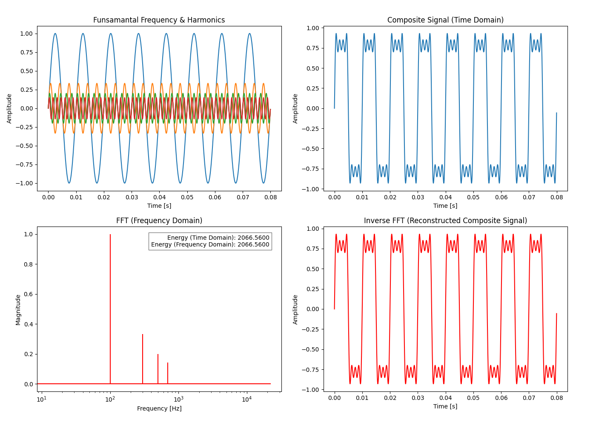

# Hello World Programs for Signal Processing with Python

## Demonstration How to Use Fast Fourier Transform (FFT) with Python

The Fourier Transform, a cornerstone of modern science, emerged through the contributions of many over centuries.  

Jean-Baptiste Joseph Fourier (early 19th century) pioneered the idea that functions could be represented as infinite sums of sine and cosine waves while studying heat diffusion. Building on earlier work by Euler and Bernoulli, his ideas were later rigorously formalized by Dirichlet, extended by Lebesgue through advances in integration, and further developed by Hilbert and Wiener in both theory and applications.

Carl Friedrich Gauss used trigonometric sums for discrete data in astronomical calculations, thus anticipating the Discrete Fourier Transform (DFT). The concept evolved over time, and in 1965, Cooley and Tukey's Fast Fourier Transform (FFT) made large-scale computations practical, revolutionizing signal processing and data analysis.  

While Fourier, Gauss, Cooley, and Tukey stand out as pivotal figures, the transform’s evolution was a collaborative endeavor, built on the insights of many mathematicians and scientists across generations.

The available code modules in this repository offer a very basic introductory experience with Fast Fourier Transforms (FFTs) using Python. They are explicitly designed for absolute beginners who are just starting to explore signal analysis and want a gentle, hands-on introduction to the core concepts of FFT. Think of it as your first "Hello, World!" program for signal processing. They provide a stepping stone for understanding how to analyze signals using FFT, progressing from simple, idealized scenarios to more complex, real-world examples.

### Modules Overview

#### 1. Analysis of Signals from the Mathematical Harmonic Signal Generator (FFT.py)

This module provides a clean, theoretical starting point, allowing users to generate and analyze mathematical signals composed of harmonics. It helps in understanding the fundamental relationship between a signal's components and its frequency representation.

#### 2. FFT Analysis of Synthetic or Ideal Signals (FFT_wav.py)

Working with WAV files generated using tools like Audacity, this module demonstrates FFT analysis in controlled, idealized environments, free of real-world noise and distortion. This allows learners to focus on the FFT process itself without the complexities of real-world data.

#### 3. FFT Analysis of Real-World Signals with Windowing (FFT_wav_windowing.py)

This module introduces the challenges of analyzing real-world signals, such as transformer noise or other environmental sounds. It incorporates preprocessing techniques like the Hann window to mitigate spectral leakage and noise, preparing signals for more effective frequency-domain analysis. This is a first glimpse into the practical considerations of real-world signal processing.

### Key Features

- **Modular and Easy-to-Understand Python Code**: The code is designed for beginners, prioritizing readability and ease of understanding.
- **Practical Examples**: Transitioning from synthetic to real-world signal analysis, the step-by-step approach ensures a gradual learning curve.
- **Expandable Framework**: While the modules are basic, they provide a foundation for further exploration and more complex analysis.

### Limitations (Highlighting the Introductory Scope)

While these modules are designed to provide a foundational understanding of FFT, there are a few inherent limitations to be aware of:

- **Noise and Interference**: Windowing techniques like the Hann window reduce spectral leakage but cannot completely eliminate noise or interference. For noisy signals, additional preprocessing (e.g., filtering) may be necessary to achieve clearer results.

- **Windowing Effects**: Windowing introduces side-lobe energy that can cause symmetric spreading around frequencies (spectral leakage). Increasing the number of cycles in the signal can mitigate this effect but does not eliminate it entirely.

- **DC Component (WAV File Processing)**: When processing WAV files, the code removes the DC offset by centering the signal (subtracting its mean) to ensure that the FFT focuses on frequency content. However, significant or fluctuating DC offsets may still impact FFT results, particularly for signals with very low-frequency components.

- **Fixed Base Frequency**: The analysis assumes that the base frequency of the signal is known or estimated beforehand. These modules do not include automatic frequency detection.

- **Multi-Channel Audio**: Multi-Channel Audio: While the program supports multi-channel WAV files, it's preferred to use mono files for the most accurate results. For multi-channel audio (e.g., stereo), the channels are averaged to create a mono signal. This approach works as a compromise but may lose some spatial or directional information from the original channels.

- **Signal Duration**: Short signals may lack enough data for meaningful FFT analysis. For better frequency resolution, longer signals are preferable.

- **Real-Time Analysis**: These modules are designed for offline signal processing. Real-time signal analysis would require additional code and optimizations.

### Final Notes

These limitations are not drawbacks but rather define the scope of these introductory modules. They highlight areas for further learning and emphasize that these modules are intended for initial exploration and basic understanding, not for advanced or production-ready signal processing. They are truly a first step into the world of FFTs in Python.

## Example WAV File

An example WAV file, `signal1.wav`, is included within the program modules in the repository. This file simulates transformer noise with the following characteristics:

## Core Non-Linearities (Magnetostrictive Noise)

- **Fundamental frequency**: 100 Hz (representing twice the AC line frequency for a 50 Hz system).
  - This fundamental noise arises from magnetostriction in the transformer core, causing vibrations at double the AC line frequency (100 Hz for 50 Hz systems).

- **Harmonics**:
  - Integer multiples of the fundamental frequency: **100 Hz, 200 Hz, 300 Hz, 400 Hz**, etc.
  - In this file, only **odd harmonics** (300 Hz, 500 Hz, 700 Hz, etc.) are included for simplicity, though in real-world scenarios, even harmonics (200 Hz, 400 Hz, etc.) may also contribute to the spectrum, depending on the transformer design and material properties.

## Load Noise (Implicitly Included in the File)

- **Noise due to Load**:
  - Load noise results from mechanical forces between conductors in the transformer windings when the transformer is under load.
  - This noise primarily occurs at the **fundamental frequency (100 Hz)** for 50 Hz systems.
  - Since the file includes a 100 Hz tone, load noise is **implicitly represented**. However, load noise does not significantly affect the overall harmonic structure, as it primarily increases the noise amplitude by **1–2 dB**.

## File Format

- **Format**: Microsoft WAV
- **Bit Depth**: 16-bit PCM
- **Sampling Rate**: 44,100 Hz

This file focuses on **magnetostrictive noise**, with load noise being represented implicitly through the 100 Hz component. The harmonic structure in this example includes only **odd harmonics 300 Hz, 500 Hz, 700 Hz** for simplicity.
